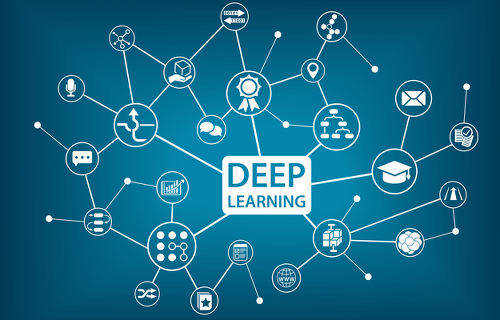

# CS231N 스터디

- 매주 일요일 22:00~23:00

## deep learning 

* cs231n 2017년 강의계획표 : http://cs231n.stanford.edu/2017/syllabus.html

### 참여인원

- 전용찬: https://cyc9805.github.io
- 이준용: https://velog.io/@dothe7847
- 윤재호: https://dkssud8150.github.io/tag-cs231n/

  
