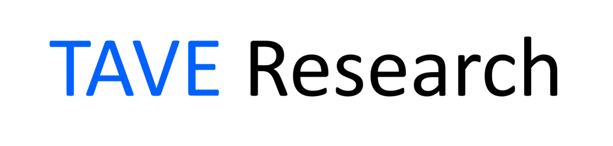

# deep learning 

 

## CS231N 스터디

- 2강씩 공부한 후 각자 블로그에 기재
- 각자 맡은 강의 설명
- 매주 일요일 *22:00~23:00*

* cs231n 2017년 강의계획표 : http://cs231n.stanford.edu/2017/syllabus.html

 

* [CS231N 한글판 번역본](https://github.com/visionNoob/CS231N_17_KOR_SUB)
* [assignment 참고 사이트](https://github.com/MahanFathi/CS231/tree/master/assignment1)

 

## 현재 진행 사항

* 총 14강 중 13강 수강
* 14강까지 수강 후 assignment 진행
* assignment는 단순히 코드만 따라서 치는 형식이기 때문에 생략하기로 함
* 11/16일에 종료!

 

## 참여인원

- 전용찬: https://cyc9805.github.io
- 이준용: https://velog.io/@dothe7847
- 윤재호: https://dkssud8150.github.io/tag-cs231n/

  
